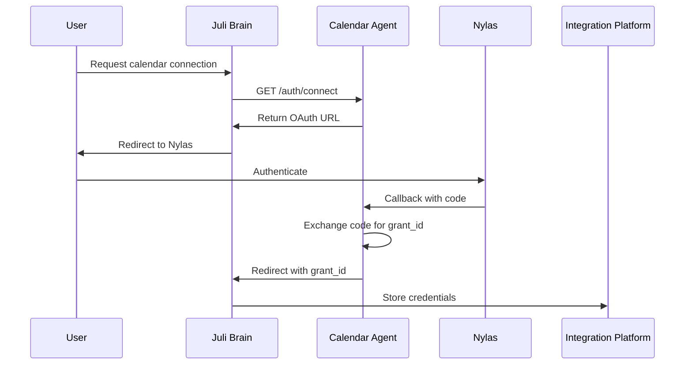

# A2A Authentication Implementation

This document describes the A2A (Agent-to-Agent) authentication implementation for Juli Calendar Agent, following the official A2A specification.

## Overview

Juli Calendar Agent implements a **stateless authentication architecture** where:
- The agent never stores credentials
- All credentials flow through Juli Brain to the Integration Platform
- OAuth follows a three-step callback chain
- Every credential has a validation endpoint

## Authentication Flow

### Three-Step OAuth Callback Chain



**Step 1**: Nylas → Agent's `/api/nylas-calendar/callback` (exchanges code for grant)  
**Step 2**: Agent → Juli Brain's `/auth/callback/juli-calendar` (redirects with grant)  
**Step 3**: Juli Brain → Integration Platform (stores in database)

## Endpoints

### Manifest Endpoints

Only these endpoints are allowed per A2A specification:

| Endpoint | Method | Purpose |
|----------|--------|---------|
| `/.well-known/a2a.json` | GET | Agent discovery manifest |
| `/.well-known/a2a-credentials.json` | GET | Credential requirements |
| `/a2a/rpc` | POST | JSON-RPC tool execution |
| `/auth/connect` | GET | Get OAuth URL for Nylas |
| `/api/nylas-calendar/callback` | GET | OAuth callback from Nylas |
| `/validate/NYLAS_GRANT_ID` | POST | Validate Nylas grant |
| `/validate/RECLAIM_API_KEY` | POST | Validate Reclaim API key |

### Removed Endpoints

These endpoints were removed to comply with A2A spec:
- ❌ `/setup/status`
- ❌ `/setup/validate`
- ❌ `/setup/validate-reclaim`
- ❌ `/setup/validate-complete`
- ❌ `/setup/instructions`
- ❌ `/setup/connect-url` (replaced by `/auth/connect`)

## Credential Manifest

The agent declares two required credentials:

```json
{
  "version": "1.0",
  "credentials": [
    {
      "key": "RECLAIM_API_KEY",
      "display_name": "Reclaim.ai API Key",
      "description": "Your personal API key from Reclaim.ai for task management",
      "sensitive": true,
      "required": true,
      "flows": [
        {
          "type": "api_key",
          "format_hint": "Long alphanumeric API key",
          "validation_endpoint": "/validate/RECLAIM_API_KEY",
          "manual": {
            "instructions": "Get your API key from Reclaim.ai...",
            "deep_link": "https://app.reclaim.ai/settings/developer",
            "requirements": "You must have a Reclaim.ai account with the same calendar connected as your Nylas account"
          }
        }
      ]
    },
    {
      "key": "NYLAS_GRANT_ID",
      "display_name": "Calendar Account",
      "description": "Connect your calendar (Google, Outlook, or iCloud)",
      "sensitive": true,
      "required": true,
      "flows": [
        {
          "type": "hosted_auth",
          "connect_url": "/auth/connect",
          "callback_url": "/api/nylas-calendar/callback",
          "validation_endpoint": "/validate/NYLAS_GRANT_ID",
          "provider": "nylas",
          "providers": ["google", "microsoft", "icloud"]
        }
      ]
    }
  ]
}
```

## Key Implementation Details

### OAuth Callback Redirect

The OAuth callback **MUST redirect to Juli Brain**, not return JSON:

```python
# Build redirect URL with grant information
params = {
    'grant_id': grant_id,
    'credential_key': 'NYLAS_GRANT_ID',
    'agent_id': 'juli-calendar',  # NOT 'inbox-mcp'!
    'email': email,
    'status': 'success'
}
redirect_url = f"{juli_brain_callback}?{urlencode(params)}"
return redirect(redirect_url)
```

### Validation Endpoints

Every credential must have a validation endpoint that:
1. Accepts `{"credential_value": "..."}` in POST body
2. Returns `{"valid": true/false}` response
3. Does NOT store the credential
4. Only validates it can be used

Example validation response:
```json
{
  "valid": true,
  "metadata": {
    "email": "user@example.com",
    "provider": "google"
  }
}
```

### Environment Variables

Required for A2A authentication:

```bash
# CRITICAL: Juli Brain callback for OAuth redirects
JULI_BRAIN_CALLBACK_URI=https://api.juliai.com/auth/callback/juli-calendar

# Nylas OAuth configuration
NYLAS_CLIENT_ID=your_client_id
NYLAS_API_KEY=your_api_key
NYLAS_CALLBACK_URI=http://localhost:5002/api/nylas-calendar/callback

# A2A Configuration
A2A_PUBLIC_BASE_URL=http://localhost:5002
```

## Testing A2A Compliance

Use the provided test script to verify compliance:

```bash
python3 test_a2a_compliance.py
```

This tests:
- ✅ Manifest endpoints exist and return correct structure
- ✅ Validation endpoints work correctly
- ✅ Non-manifest endpoints have been removed
- ✅ OAuth callback redirects (manual test required)

## Common Mistakes to Avoid

1. **DON'T return JSON from OAuth callback** - Must redirect to Juli Brain
2. **DON'T create `/setup/*` endpoints** - Only manifest-declared endpoints
3. **DON'T store credentials** - Agent must be stateless
4. **DON'T skip validation endpoints** - Required for all auth types
5. **DON'T use wrong agent_id** - Use 'juli-calendar', not 'inbox-mcp'
6. **DON'T treat manual as auth type** - It's a modifier for any type

## Migration from Old Authentication

If migrating from the old setup:

1. Remove all `/setup/*` endpoints
2. Update OAuth callback to redirect instead of returning JSON
3. Add `JULI_BRAIN_CALLBACK_URI` to environment
4. Update credential manifest:
   - Change `manual_with_validation` to `api_key` with `manual` modifier
   - Add `validation_endpoint` for all credentials
   - Use `/validate/{credential_key}` pattern
5. Implement validation endpoints for each credential
6. Test with `test_a2a_compliance.py`

## References

- [A2A Authentication Specification](https://github.com/Juli-AI/juli-email/docs/a2a/A2A_AUTH_SPECIFICATION.md)
- [Juli Brain Integration](https://docs.juliai.com/agents/authentication)
- [Nylas OAuth Documentation](https://developer.nylas.com/docs/v3/auth/)